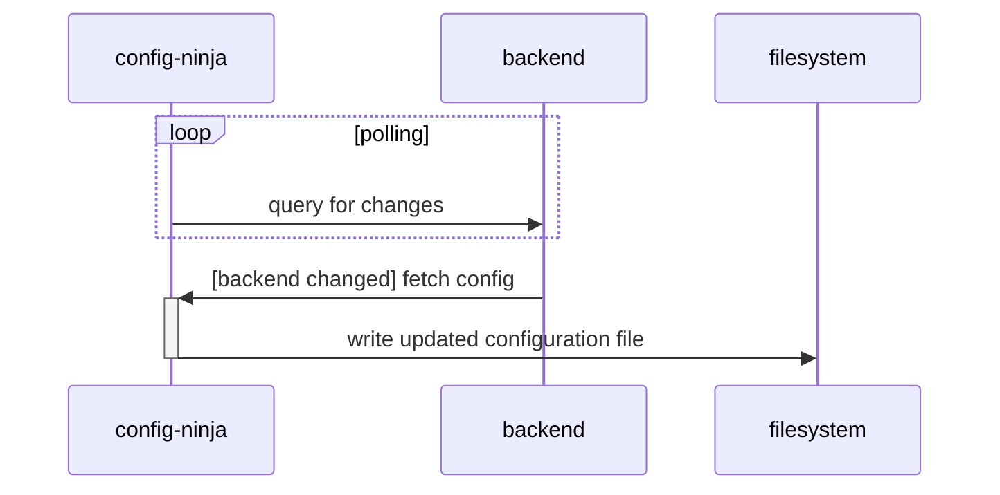

# Config Ninja 🥷

[](https://github.com/astral-sh/ruff)
[](https://github.com/bryant-finney/config-ninja/actions/workflows/push-poe.yaml)
[](https://bryant-finney.github.io/config-ninja/reports/pylint-report.txt)
[](https://codecov.io/gh/bryant-finney/config-ninja)
[](https://results.pre-commit.ci/latest/github/bryant-finney/config-ninja/main)
[](https://bryant-finney.github.io/config-ninja/reports/mypy-html)
[](https://bryant-finney.github.io/config-ninja/config_ninja.html)
[](https://badge.fury.io/py/config-ninja)
[](https://pepy.tech/project/config-ninja)

Similar to [`confd`](https://github.com/kelseyhightower/confd), manage your system configuration files by populating [Jinja2](https://jinja.palletsprojects.com/en/3.1.x/) templates with data from a remote provider.

## Installation

`config-ninja` is installed using the official installer or with `pip` / `pipx`. If your system supports `systemd`, you can then enable `config-ninja` as a `systemd` service.

### Official Installer

The recommended way to install `config-ninja` is with the official installer:

```sh
curl -sSL https://bryant-finney.github.io/config-ninja/install.py | python3 -
```

To view available installation options, run the installer with the `--help` flag:

```sh
curl -sSL https://bryant-finney.github.io/config-ninja/install.py | python3 - --help
```

```
usage: install [-h] [--version VERSION] [--pre] [--uninstall] [--force] [--path PATH] [--backends BACKENDS]

Installs the latest (or given) version of config-ninja

options:
  -h, --help           show this help message and exit
  --version VERSION    install named version
  --pre                allow pre-release versions to be installed
  --uninstall          uninstall config-ninja
  --force              respond 'yes' to confirmation prompts; overwrite existing installations
  --path PATH          install config-ninja to this directory
  --backends BACKENDS  comma-separated list of package extras to install, or 'none' to install no backends
```

#### With `pip` / `pipx`

Alternatively, use `pip` / `pipx` to install [all available backends] (or choose a specific one):

```sh
pip install 'config-ninja[all]'
```

### Enable the `systemd` Service

After installing `config-ninja`, enable it as a `systemd` service for the current user:

```sh
# omit '--user' to install the agent at the system level
config-ninja self install --user
```

[all available backends]: https://bryant-finney.github.io/config-ninja/config_ninja/contrib.html#available-backends

## How It Works

To demonstrate how the mechanics work locally:

1. create a settings file for `config-ninja`:
   ```sh
   cat <<EOF >config-ninja-settings.yaml
   CONFIG_NINJA_OBJECTS:
     example-0:
       dest:
         format: json
         path: ./.local/settings.json
       source:
         backend: local
         format: toml
         init:
           kwargs:
             path: ./.local/config.toml
   EOF
   ```
2. start `config-ninja` in `monitor` mode:
   ```sh
   config-ninja monitor
   ```
3. in a separate shell, create the `config.toml`:
   ```sh
   cat <<EOF >./.local/config.toml
   [example-0]
   a = "first value"
   b = "second value
   EOF
   ```
4. inspect the generated `settings.json`:
   ```sh
   cat ./.local/settings.json
   ```
   ```json
   {
     "example-0": {
       "a": "first value",
       "b": "second value"
     }
   }
   ```
5. Make changes to the data in `config.toml`, and `config-ninja` will update `settings.json` accordingly:
   ```sh
   cat <<EOF >>./.local/config.toml
   [example-1]
   c = "third value"
   d = "fourth value
   EOF
   cat ./.local/settings.json
   ```
   ```json
   {
     "example-0": {
       "a": "first value",
       "b": "second value"
     },
     "example-1": {
       "1": "third value",
       "2": "fourth value"
     }
   }
   ```
   Chances are, you'll want to update the `config-ninja-settings.yaml` file to use a remote backend (instead of `local`). See [config_ninja.contrib](https://bryant-finney.github.io/config-ninja/config_ninja/contrib.html) for a list of supported config providers.

## Configuration Architecture

The `config-ninja` agent monitors the backend source for changes. When the source data is changed, the agent updates the local configuration file with the new data:


